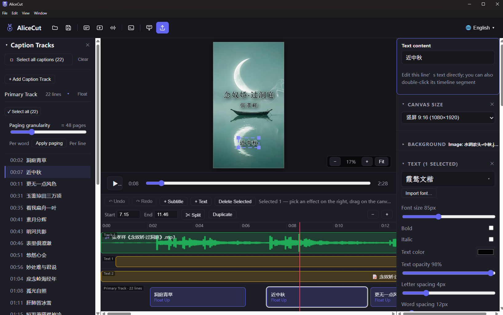

# AliceCut

**A caption-first desktop video editor for kinetic typography, lyric videos, and automated content workflows.**

AliceCut combines multi-track caption editing, a layered audio/video timeline, deterministic Canvas rendering, and a JSON-driven agentic workflow in one Electron application. It is designed for projects where captions are not an afterthought—they are the structure of the edit.

> AliceCut is currently in beta. The Windows build is the primary tested distribution.



## What AliceCut does

### Caption-first editing

- Import LRC, enhanced LRC, SRT, VTT, and timestamped text files.
- Preserve precise word/character timing when available and interpolate timing for standard LRC files.
- Replace the primary captions or import another file as an independent caption track.
- Edit multiple caption tracks for translations, pronunciation guides, alternate versions, or layered text.
- Drag caption segments to retime them, trim either edge, edit text directly, and batch-select captions.
- Add standalone text blocks for titles, watermarks, labels, and annotations.
- Export an individual caption track as SRT.

### Layered media timeline

- Import multiple video and audio files into independent timeline layers.
- View audio waveforms and align captions visually with the soundtrack.
- Move, trim, duplicate, split, loop, and change clip speed from `0.25×` to `4×`.
- Control audio volume, fades, and mixing; extract an audio track from a video.
- Stack video layers for backgrounds and picture-in-picture compositions.
- Pan, scale, and rotate video directly in the composition.
- Automatically convert media that Chromium cannot decode using the bundled FFmpeg executable.

### Typography and motion design

- Apply entrance and exit effects globally or per caption line.
- Use 47 built-in effects, including per-character, per-word, karaoke, highlight, directional, glitch, elastic, blur, and docked-history animations.
- Adjust font, weight, size, spacing, alignment, orientation, fill, stroke, opacity, glow, shadow, and caption background.
- Drag selected captions directly on the preview canvas.
- Use solid colors, gradients, images, or video as the visual background.
- Choose `9:16`, `16:9`, or `1:1` output compositions.

### GUI, agentic, and headless workflows

AliceCut exposes the same editing model through three surfaces:

1. **Desktop editor** — interactive caption, media, style, preview, and export controls.
2. **Command Console** — apply JSON instructions to the project currently open in the editor.
3. **Headless jobs** — render or generate projects from `job.json` for batch processing and pipelines.

The console and headless paths share one project-command layer, and all three surfaces ultimately use the same project state, rendering core, and export pipeline. This reduces behavioral drift between manual and automated work.

## Quick start

### Install the Windows beta

Download the latest installer from [GitHub Releases](https://github.com/a-homosapiens/alicecut/releases). The assisted installer allows you to choose the installation directory.

Unsigned development builds may trigger a Windows SmartScreen warning. Production releases should be code-signed before broad distribution.

### Create a video

1. Select **Import Lyrics** and open an LRC, SRT, VTT, or timestamped text file.
2. Import an audio track and, optionally, one or more videos or background images.
3. Arrange captions and media on the timeline.
4. Choose typography, layout, background, entrance effects, and exit effects.
5. Press `Space` to preview from the playhead.
6. Save an AliceCut project.
7. Select **Export Video**, then choose codec, container, quality, frame rate, and output location.

The application includes an offline quick-start page under **Help → Help**.

## Portable project files

AliceCut project files use the `.alicecut.json` extension. Project format v6 records both absolute fallback paths and portable paths relative to the project file.

Keep the project and its resources together when moving work between computers:

```text
My Project/
├── project.alicecut.json
├── media/
│   ├── music.mp3
│   └── background.mp4
└── images/
    └── cover.png
```

For example, the stored relative paths are `media/music.mp3` and `images/cover.png`. AliceCut prefers the relative copy after a project is moved and falls back to the original absolute location when necessary. Media is referenced rather than embedded, so copy the resource folders together with the project file.

Projects created with v1–v5 remain supported and are upgraded when saved again.

## Supported files

| Purpose | Formats |
|---|---|
| Captions | LRC, enhanced LRC, SRT, VTT, timestamped TXT |
| Audio | MP3, WAV, M4A, AAC, FLAC, OGG |
| Video | MP4, MOV, M4V, WebM, MKV, AVI, FLV, WMV, TS, MPG, MPEG, 3GP |
| Images | JPG, JPEG, PNG, BMP |
| Imported fonts | TTF, OTF, WOFF, WOFF2 |
| Project | `.alicecut.json` |
| Caption export | SRT |
| Video export | H.264 or HEVC in MP4/MOV; ProRes in MOV |

Unsupported editing codecs and containers are normalized to an H.264 MP4 proxy and cached locally. The original source path remains in the project so AliceCut can recreate a proxy on another machine.

## Command Console

Open the Command Console from the toolbar or **View** menu and enter a JSON command. Commands operate on the current project and can be undone like manual edits.

```json
{
  "select": "captions",
  "effectIn": "wave-in",
  "effectOut": "evaporate-out",
  "selectedStyle": {
    "fontSize": 96,
    "textAlign": "center",
    "strokeWidth": 4
  }
}
```

The console can also import captions and media, add caption tracks and text blocks, apply project styles, and assign line-level effects. File paths supplied to the live console must be absolute because there is no job-file directory to use as a relative base.

## Headless rendering and project generation

The same application binary can render without showing the editor:

```powershell
# Installed Windows application
AliceCut.exe --export job.json

# Save a GUI-compatible project without rendering video
AliceCut.exe --save-project job.json

# Perform both operations
AliceCut.exe --export job.json --save-project job.json
```

Example `job.json`:

```json
{
  "lrc": "captions/song.lrc",
  "audio": "media/song.mp3",
  "video": [
    {
      "path": "media/background.mp4",
      "start": 0,
      "loop": "infinite",
      "scale": 1.1
    }
  ],
  "out": "output/video.mp4",
  "fps": 30,
  "codec": "h264",
  "speed": "balanced",
  "hwAccel": "auto",
  "style": {
    "aspect": "9:16",
    "effectId": "rise",
    "fontSize": 92
  },
  "lineEffects": {
    "0-7": "wave-in",
    "8": "punch"
  },
  "lineEffectsOut": {
    "0-7": "evaporate-out"
  }
}
```

Paths in a headless job are resolved relative to the `job.json` file. Progress is written to stdout as `[export] 37%`; the process exits with code `0` on success and `1` on failure.

See the [manual's automation section](docs/MANUAL.md#13-命令行--pipeline-自动化) for the complete job schema.

## Export pipeline

- H.264, HEVC, and ProRes output.
- MP4 and MOV containers.
- 30 or 60 fps from the desktop export dialog; headless jobs accept 10–60 fps.
- Fast, balanced, and quality presets.
- Runtime hardware-encoder detection with safe software fallback.
- AAC audio mixing with clip volume, fades, loops, offsets, and tempo-preserving speed changes.
- A WebCodecs H.264 path when supported, with a deterministic raw-frame fallback.
- Static-background optimization and repeated-frame coalescing for caption-heavy projects.

Preview and export share the same Canvas rendering core. Background-video export defaults to a faster forward-decoding mode; an exact frame-seek mode remains available for reproducible pipeline work.

## Development

### Requirements

- Node.js 20 or newer
- npm
- Git LFS for repository-managed font assets

### Run locally

```bash
git lfs install
git clone https://github.com/a-homosapiens/alicecut.git
cd alicecut
npm ci
npm run dev
```

### Verification and packaging

```bash
npm run typecheck          # TypeScript validation
npm test                   # Core and state test suite
npm run build              # Production bundles in out/
npm run smoke:electron     # Hidden Electron import/project smoke test
npm run smoke:help         # Render bundled Help and About pages
npm run dist:win:unsigned  # Assisted unsigned Windows installer
```

The Windows beta workflow in `.github/workflows/windows-beta.yml` runs type checking, tests, an Electron smoke test, and the signed installer build for beta tags.

## Repository structure

```text
electron/       Electron main process, IPC, menus, FFmpeg conversion/export, headless jobs
src/components/ React editor UI
src/core/       Caption parsing, media math, effects, layout, rendering, subtitles
src/store/      Project and window state
public/         Assets bundled with the application: fonts, previews, Help, branding
font-assets/    Optional on-demand fonts managed with Git LFS
scripts/        Packaging, asset generation, benchmarks, and smoke tests
docs/           User manual, design notes, future work, and README assets
```

## Documentation

| Document | Contents |
|---|---|
| [User Manual](docs/MANUAL.md) | Complete editor workflow, timeline behavior, effects, shortcuts, automation schema, and troubleshooting |
| [Design Document](docs/DESIGN.md) | Architecture, state model, rendering pipeline, effect system, export implementation, and engineering decisions |
| [Future Tasks](docs/FUTURE_TASKS.md) | Planned relinking, project collection, and media-management improvements |
| **Help → Help** | Offline quick start bundled with the desktop application |

## Fonts and third-party assets

AliceCut ships Smiley Sans, Noto Sans SC, and Inter as starter fonts, and provides previews for optional fonts that can be downloaded on demand. Font binaries are managed with Git LFS; repository handling requirements are documented in [font-assets/README.md](font-assets/README.md).

Current optional font sources include [Masa Font](https://github.com/max32002/masafont), [Noto Sans SC](https://fonts.google.com/noto/specimen/Noto%2BSans%2BSC), [Noto Serif SC](https://fonts.google.com/noto/specimen/Noto%2BSerif%2BSC), [Inter](https://fonts.google.com/specimen/Inter), [Anton](https://fonts.google.com/specimen/Anton), [Fredoka](https://fonts.google.com/specimen/Fredoka), [Playfair Display](https://fonts.google.com/specimen/Playfair%2BDisplay), [ChongXi Seal](https://xiaoxue.iis.sinica.edu.tw/chongxi/copyright.htm), and [ToronoGlitch](https://github.com/amazusa/ToronoGlitch). Verify each asset's upstream license before adding or redistributing it. ChongXi Seal uses CC BY-ND 3.0 Taiwan and must retain attribution without modification; ToronoGlitch is distributed under the SIL Open Font License according to its upstream repository.

## About

AliceCut is developed by [Artificial Homo Sapiens](https://www.ArtificialHomoSapiens.com/), a company of Homo sapiens, by Homo sapiens, and for Homo sapiens.
